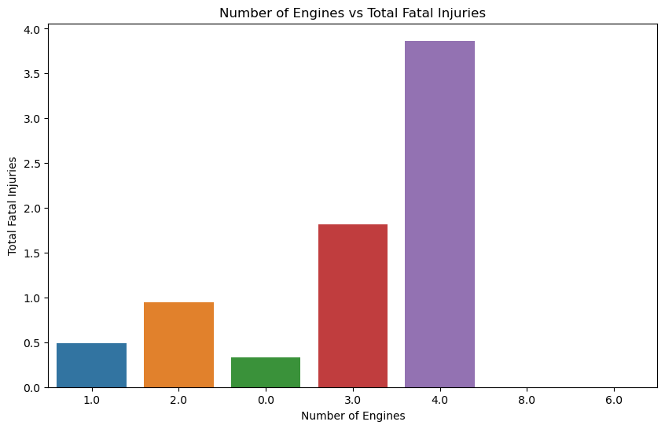
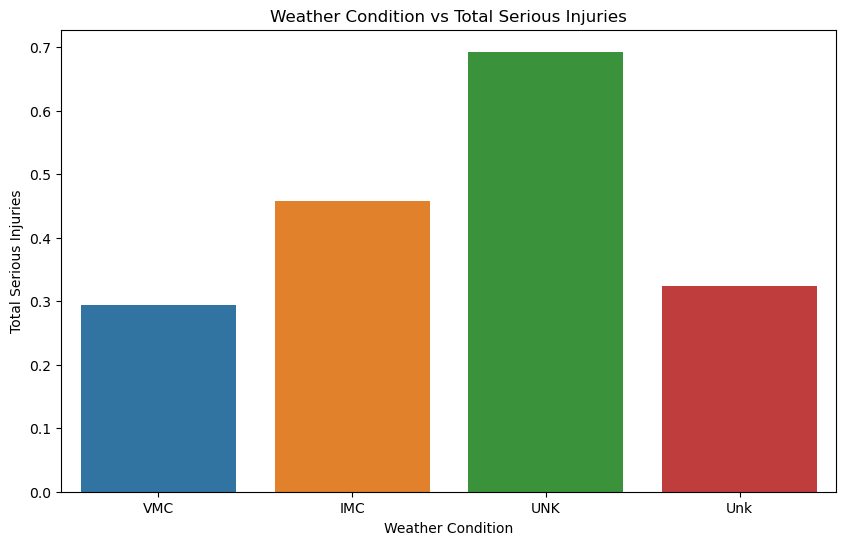
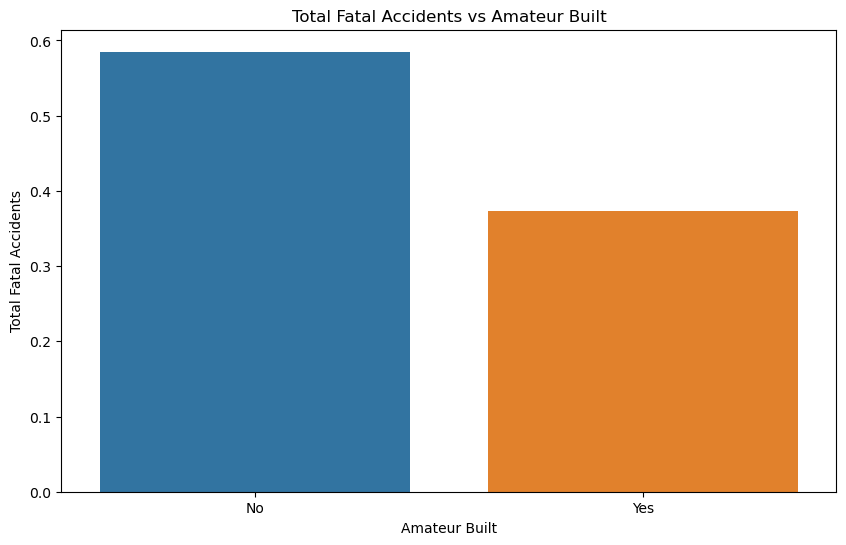

# **Phase 1 Project Description**
In this project description, we will cover:

Project Overview: the project goal, audience, and dataset
Deliverables: the specific items you are required to produce for this project
Grading: how your project will be scored

## **Project Overview**
For this project, you will use data cleaning, imputation, analysis, and visualization to generate insights for a business stakeholder.

## **Business Problem**
Your company is expanding in to new industries to diversify its portfolio. Specifically, they are interested in purchasing and operating airplanes for commercial and private enterprises, but do not know anything about the potential risks of aircraft. You are charged with determining which aircraft are the lowest risk for the company to start this new business endeavor. You must then translate your findings into actionable insights that the head of the new aviation division can use to help decide which aircraft to purchase.

## **The Data**
In the data folder is a datasetLinks to an external site. from the National Transportation Safety Board that includes aviation accident data from 1962 to 2023 about civil aviation accidents and selected incidents in the United States and international waters.

It is up to you to decide what data to use, how to deal with missing values, how to aggregate the data, and how to visualize it in an interactive dashboard.

## **Key Points**
Your analysis should yield three concrete business recommendations. The key idea behind dealing with missing values, aggregating and visualizaing data is to help your organization make data driven decisions. You will relate your findings to business intelligence by making recommendations for how the business should move forward with the new aviation opportunity.

Create a storyline your audience (the head of the aviation division) can follow by walking them through the steps of your process, highlighting the most important points and skipping over the rest.

Use plenty of visualizations. Visualizations are invaluable for exploring your data and making your findings accessible to a non-technical audience. Spotlight visuals in your presentation, but only ones that relate directly to your recommendations. Simple visuals are usually best (e.g. bar charts and line graphs), and don't forget to format them well (e.g. labels, titles).

### **Deliverables**
There are three deliverables for this project:

A non-technical presentation
A Jupyter Notebook
A GitHub repository
An Interactive Dashboard
Non-Technical Presentation
The non-technical presentation is a slide deck presenting your analysis to business stakeholders.

Non-technical does not mean that you should avoid mentioning the technologies or techniques that you used, it means that you should explain any mentions of these technologies and avoid assuming that your audience is already familiar with them.
Business stakeholders means that the audience for your presentation is the business, not the class or teacher. Do not assume that they are already familiar with the specific business problem.
The presentation describes the project goals, data, methods, and results. It must include at least three visualizations which correspond to three business recommendations.

### **Project Structure**

-Beginning
-Overview
-Business Understanding
-Middle
-Data Understanding
-Data Analysis
-End
-Recommendations
-Next Steps
T-hank You
This slide should include a prompt for questions as well as your contact information (name and LinkedIn profile)
You will give a live presentation of your slides and submit them in PDF format on Canvas. The slides should also be present in the GitHub repository you submit with a file name of presentation.pdf.

The graded elements of the presentation are:

Presentation Content
Slide Style
Presentation Delivery and Answers to Questions

The Jupyter Notebook is a notebook that uses Python and Markdown to present your analysis to a data science audience.

Python and Markdown means that you need to construct an integrated .ipynb file with Markdown (headings, paragraphs, links, lists, etc.) and Python code to create a well-organized, skim-able document.
The notebook kernel should be restarted and all cells run before submission, to ensure that all code is runnable in order.
Markdown should be used to frame the project with a clear introduction and conclusion, as well as introducing each of the required elements.
Data science audience means that you can assume basic data science proficiency in the person reading your notebook. This differs from the non-technical presentation.
Along with the presentation, the notebook also describes the project goals, data, methods, and results.

You will submit the notebook in PDF format on Canvas as well as in .ipynb format in your GitHub repository.

The graded elements for the Jupyter Notebook are:

Business Understanding
Data Understanding
Data Preparation
Data Analysis
Code Quality

Interactive Dashboard
The interactive dashboard is a collection of views that allows the viewer to change the views to understand different features in the data. This dashboard will be linked within your GitHub repository README.md file so that users can explore your analysis. Make sure you follow visual best practices that you have learned in this course. Below is an example of what you could produce for this assignment. tableau dashboard for aviation accidents

Grading
To pass this project, you must pass each project rubric objective. The project rubric objectives for Phase 1 are:

Data Communication
Authoring Jupyter Notebooks
Data Manipulation and Analysis with pandas
Interactive Data Visualization
Data Communication

Because "communication" can encompass such a wide range of contexts and skills, we will specifically focus our Phase 1 objective on Data Communication. We define Data Communication as:

Communicating basic data analysis results to diverse audiences via writing and live presentation

To further define some of these terms:

By "basic data analysis" we mean that you are filtering, sorting, grouping, and/or aggregating the data in order to answer business questions. This project does not involve inferential statistics or machine learning, although descriptive statistics such as measures of central tendency are encouraged.
By "results" we mean your three visualizations and recommendations.
By "diverse audiences" we mean that your presentation and notebook are appropriately addressing a business and data science audience, respectively.

## **Visualizations**
The visualozations that i came up with at the end of the project were:

## **Conclusion**
From the visualizations above and some others that i came up with as i did the project, I came up with the following conclusions:
-Aircrafts with more than two engines got into more accidents compared to the ones with one or two engines.
-Accidents are linked to more than just the plane itself. Weather conditions also cause accidents since the pilots are not able to navigate through unclear skies. So they are left with relying on the navigation instruments on the plane to pass through safely. Sol the planes with the latest and up-to-date navigation instruments got into far less accidents.
-Aircrafts built by big companies got into more accidents compared to aircrafts built by amateurs or at home. 

From these conclusions, i was able to give the business the following recommendations:
-When purchasing an aircraft for the business, purchase the ones with fewer engines as they are safer as learnt from the dataset
-When purchasing aircrafts one should invest on the equipment on the aircraft as they are very important in helping the pilot navigate safely even in dangerous conditions such as bad weather.
-When purchasing aircrafts, one should purchase form amateurs or very small companies as they seem to create their planes with care and ensure safety as they get into far less accidents as compared to the aircrafts made by big companies. 

#### **Summary**
As the business is planning on joining this venture, i recommend that they spare nothing to ensure that thir aircrafts will be safe for its passengers like getting aircrafs with few engines or getting aircrafts with up-to-date equipment like navigation instruments for the plane. When this is all done and they have made sure that their planes are safe by following the recommendations, i believe that their planes will always have a good reputation for its safety and this will help them in the business.